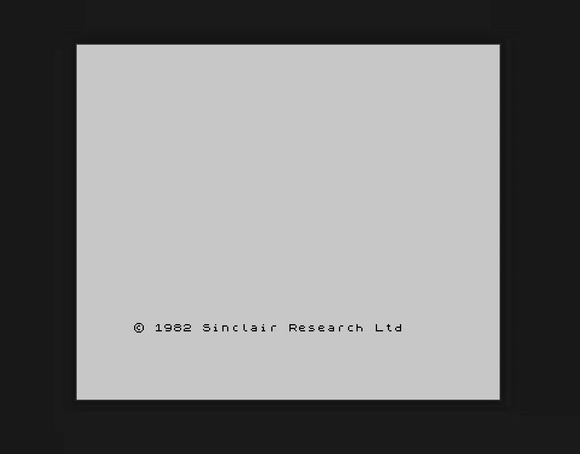
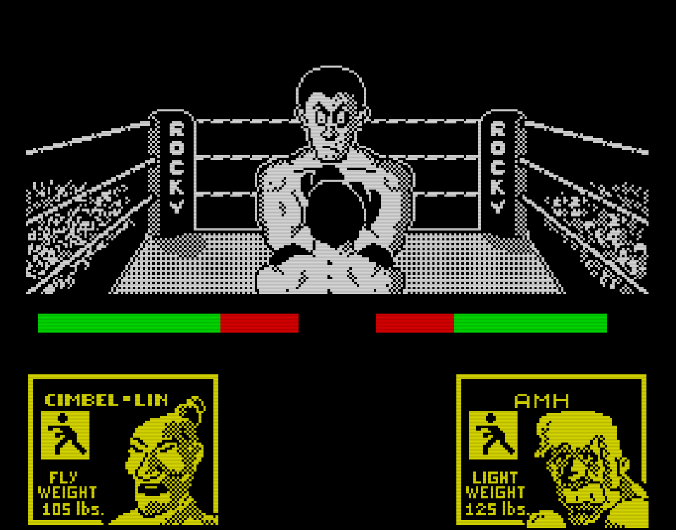
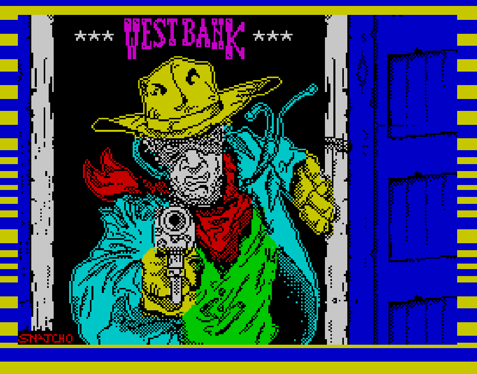
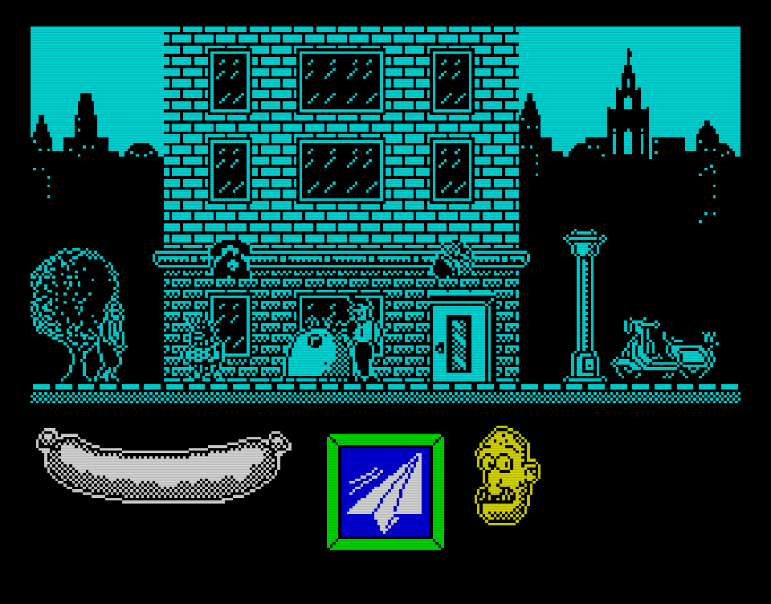

# ZX Generation
[](https://hi-score.dev/)

*ZX Generation* is a modern, JavaScript-powered emulator of the legendary **Sinclair ZX Spectrum** home computer.  

**100 % AI-crafted** — the project was conceived, designed, and developed end-to-end by LLMs (Large Language Models).  
The codebase was generated, reviewed, and refined primarily with **Anthropic Claude (Claude Code)**.

> *No human lines were typed:* every commit originates from model output; human input was limited to prompting, dependency wiring, CI/CD orchestration and few documentation details.

## Why this matters
- **Transparency** – Showcases the current state of autonomous software engineering.  
- **Benchmarking** – Serves as a live case-study for AI-generated code quality, maintainability, and performance.  

## Limitations & future work
- Edge-case fuzzing for every ZX instruction is still pending.  
- Performance tuning (JIT, SIMD) is on the roadmap.  
- Expect rapid iteration as newer model checkpoints become available.

## Live demo
👉 **Try it here:** <https://hi-score.dev/>

---

## Table of Contents

- [ZX Generation](#zx-generation)
  - [Why this matters](#why-this-matters)
  - [Limitations \& future work](#limitations--future-work)
  - [Live demo](#live-demo)
  - [Table of Contents](#table-of-contents)
  - [Features](#features)
  - [Screenshots](#screenshots)
  - [Quick Start](#quick-start)
    - [Basic usage](#basic-usage)
    - [Loading programs](#loading-programs)
  - [Examples](#examples)
  - [Browser Support](#browser-support)
  - [API Reference](#api-reference)
  - [src file structure](#src-file-structure)
  - [Development Guide](#development-guide)
  - [License](#license)

---

## Features

- **Cycle-accurate Z80 CPU emulation**  
- **Full 48 K Spectrum support**  
- **Pixel-perfect video output** (256 × 192) with border and colour-clash effects  
- **Authentic audio** via the Web Audio API - **needs improvements**
- **Tape loading** for `.TAP` and  `.TZX` files and **snapshot** loading/saving for `.Z80` files  
- **On-screen touch keyboard** for mobile devices  
- **Turbo mode** to run the CPU faster than real-time  
- **Zero dependencies** — pure ES 2023 JavaScript modules  
- **Responsive layout** for phones and tablets  

---

## Screenshots

<table>
  <tr>
    <td></td>
    <td></td>
  </tr>
  <tr>
    <td></td>
    <td></td>
  </tr>
</table>

---

## Quick Start

### Basic usage

```html
<!DOCTYPE html>
<html lang="en">
<head>
    <meta charset="UTF-8">
    <title>ZX Spectrum</title>
    <style>
        body {
            display: flex;
            justify-content: center;
            align-items: center;
            min-height: 100vh;
            margin: 0;
            background: #000;
        }
    </style>
</head>
<body>
    <canvas id="screen"></canvas>
    <script type="module">
        import { ZXSpectrum } from 'https://cdn.jsdelivr.net/npm/zx-generation@latest/dist/zxgeneration.esm.js';
        new ZXSpectrum('#screen');
    </script>
</body>
</html>
```

### Loading programs

```javascript
// Load a TAP file
const tap = await fetch('game.tap').then(r => r.arrayBuffer());
spectrum.loadTape(new Uint8Array(tap));

// Type the LOAD "" command
spectrum.typeText('J""\n');

// Start tape playback
spectrum.playTape();
```

---

## Examples

| File                      | Description                                            |
| ------------------------- | ------------------------------------------------------ |
| **examples/minimal.html** | Truly minimal emulator setup                           |
| **examples/basic.html**   | Full-featured interface with controls and tape loading |
| **examples/retro.css**    | ZX Spectrum themed styling for examples                |

---

## Browser Support

| Browser         | Version | Status            |
| --------------- | ------- | ----------------- |
| Chrome          | 80 +    | ✅ Fully supported |
| Firefox         | 75 +    | ✅ Fully supported |
| Safari          | 13.1 +  | ✅ Fully supported |
| Edge (Chromium) | 80 +    | ✅ Fully supported |
| Chrome Android  | 80 +    | ✅ Fully supported |
| Mobile Safari   | 13.4 +  | ✅ Fully supported |

---

## API Reference

```ts
class ZXSpectrum {
  constructor(canvasOrSelector: string | HTMLCanvasElement, options?: Options);

  // ROM Management
  loadROM(data: Uint8Array): void;
  loadROMFromURL(url: string): Promise<void>;

  // Emulation Control
  start(): Promise<void>;
  stop(): void;
  reset(): void;
  setTurboMode(enabled: boolean): void;
  destroy(): void;

  // Tape Operations
  loadTape(data: ArrayBuffer | Uint8Array, filename?: string): void;
  loadTapeFromURL(url: string): Promise<void>;
  playTape(): void;
  pauseTape(): void;
  stopTape(): void;
  rewindTape(): void;
  getTapeStatus(): TapeStatus;

  // Keyboard Input
  keyDown(keyOrEvent: string | KeyboardEvent): void;
  keyUp(keyOrEvent: string | KeyboardEvent): void;
  keyPress(keyOrEvent: string | KeyboardEvent, duration?: number): Promise<void>;
  typeText(text: string, options?: TypeOptions): Promise<void>;
  setKeyMapping(pcKey: string, spectrumKey: string | KeyMapping): void;
  setKeyMappings(mappings: Record<string, string | KeyMapping>): void;
  clearCustomKeyMappings(): void;

  // Snapshots
  loadSnapshot(data: SnapshotData): void;
  loadZ80Snapshot(data: ArrayBuffer | Uint8Array): void;
  saveSnapshot(): SnapshotData;

  // Memory Access
  poke(address: number, value: number): void;
  peek(address: number): number;

  // Audio Control
  setVolume(volume: number): void;
  setMuted(muted: boolean): void;
  setAudioDebugMode(enabled: boolean): void;

  // Statistics
  getStats(): EmulatorStats;
}

interface Options {
  rom?: string | Uint8Array;        // ROM data or URL (default: CDN URL)
  autoStart?: boolean;              // Start automatically (default: true)
  sound?: boolean;                  // Enable sound (default: true)
  useAudioWorklet?: boolean;        // Use AudioWorklet API (default: true)
  scale?: number | 'auto';          // Display scale (default: 'auto')
  handleKeyboard?: boolean;         // Handle keyboard input (default: true)
  touchKeyboard?: boolean | 'auto'; // Touch keyboard support (default: 'auto')
  fps?: number;                     // Frames per second (default: 50)
  onReady?: (emulator: ZXSpectrum) => void;
  onError?: (error: Error) => void;
}

interface TypeOptions {
  keyDelay?: number;    // Delay between keys in ms (default: 100)
  keyDuration?: number; // Key press duration in ms (default: 50)
}

interface TapeStatus {
  status: string;
  position: number;
  playing: boolean;
  paused: boolean;
}

interface SnapshotData {
  ram: Uint8Array;
  cpu: CPUState;
  ula: { borderColor: number };
}
```

---

## src file structure

```
src/
├── core/              # Z80 CPU core
│   ├── cpu.js         # Main CPU emulation
│   ├── registers.js   # CPU registers implementation
│   └── flags.js       # CPU flags handling
├── decoder/           # Instruction decoding
│   └── instruction-decoder.js
├── instructions/      # Z80 instruction implementations
│   ├── arithmetic.js  # Arithmetic operations
│   ├── bit.js         # Bit manipulation
│   ├── extended.js    # Extended instruction set
│   ├── indexed.js     # IX/IY indexed instructions
│   ├── jump.js        # Jump and call instructions
│   ├── load.js        # Load and store operations
│   ├── logical.js     # Logical operations
│   └── misc.js        # Miscellaneous instructions
├── interfaces/        # Hardware interfaces
│   ├── io-interface.js     # I/O port interface
│   └── memory-interface.js # Memory access interface
├── spectrum/          # ZX Spectrum hardware emulation
│   ├── spectrum.js    # Main emulator class
│   ├── memory.js      # Memory management
│   ├── display.js     # Video display rendering
│   ├── ula.js         # ULA chip emulation
│   ├── sound.js       # Basic sound generation
│   ├── audio-worklet.js # Advanced audio using Web Audio
│   ├── tape.js        # Tape loading emulation
│   ├── snapshot.js    # Snapshot loading/saving
│   └── touch-keyboard.js # Touch screen keyboard
└── utils/             # Helper utilities
    ├── debugger.js    # Debugging utilities
    └── helpers.js     # General helper functions
```

---

## Development Guide

1. **Clone the repository**
   
   ```bash
   git clone https://github.com/alvaromah/zx-generation
   cd zx-generation
   ```

2. **Serve the files**
   
   ```bash
   # Python
   python -m http.server 8000
   
   # Node.js
   npx serve .
   
   # PHP
   php -S localhost:8000
   ```

3. **Open the demo**
   
   Visit [http://localhost:8000/examples/basic.html](http://localhost:8000/examples/basic.html) in your browser.


---

## License

MIT — see the [LICENSE](LICENSE) file for details.

> The original ZX Spectrum ROM (`rom/48k.rom`) is copyright **Sky UK Limited** (acquired from Amstrad plc). Distributed solely for use with emulators under Amstrad’s permission. See `rom/README.md` for the full copyright notice.

---

Made with ❤️ + 🤖 for the ZX Spectrum community
